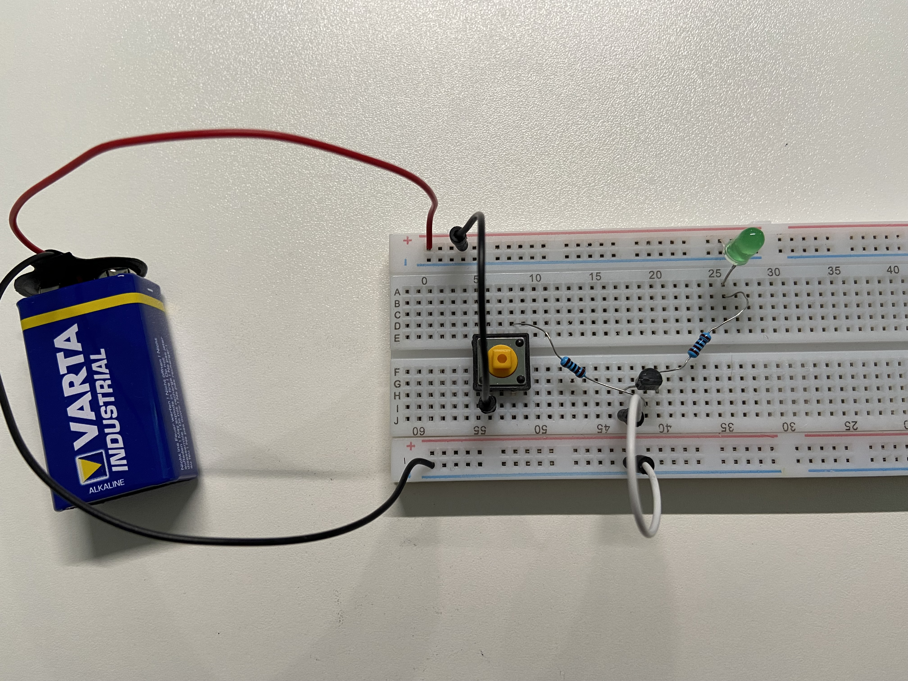
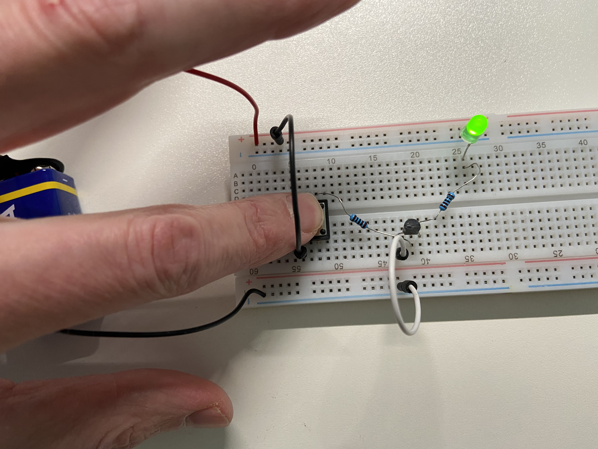
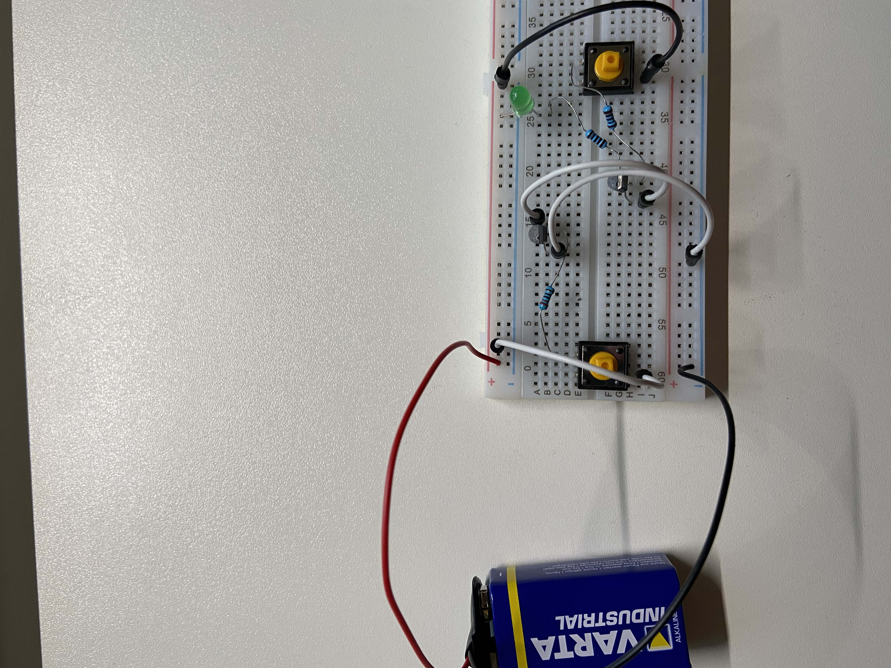
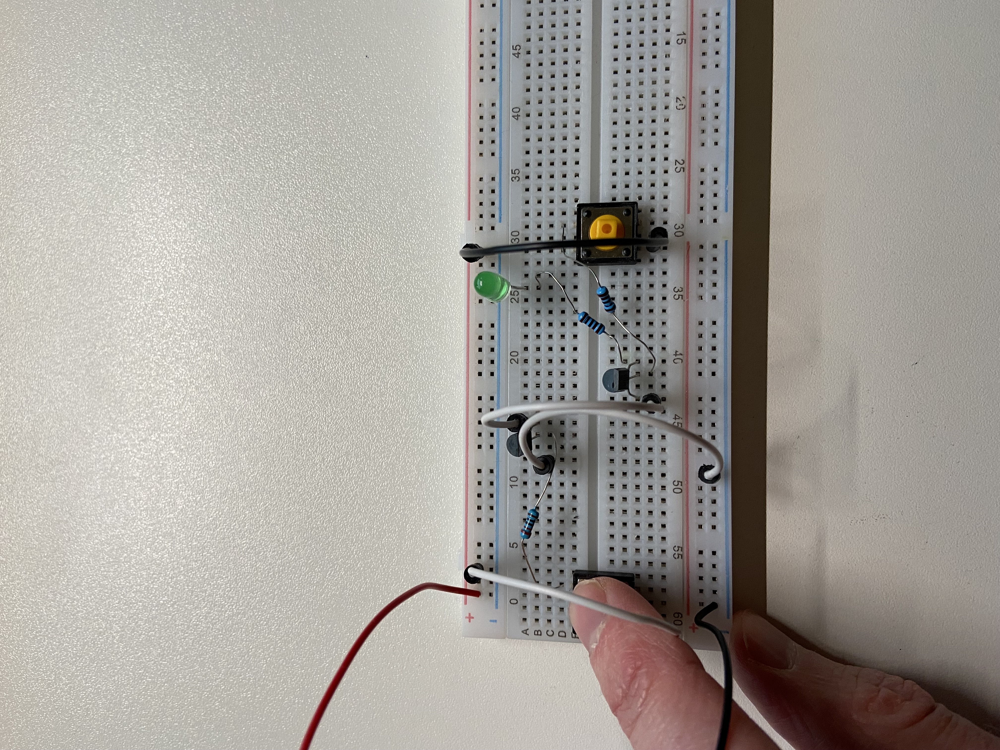
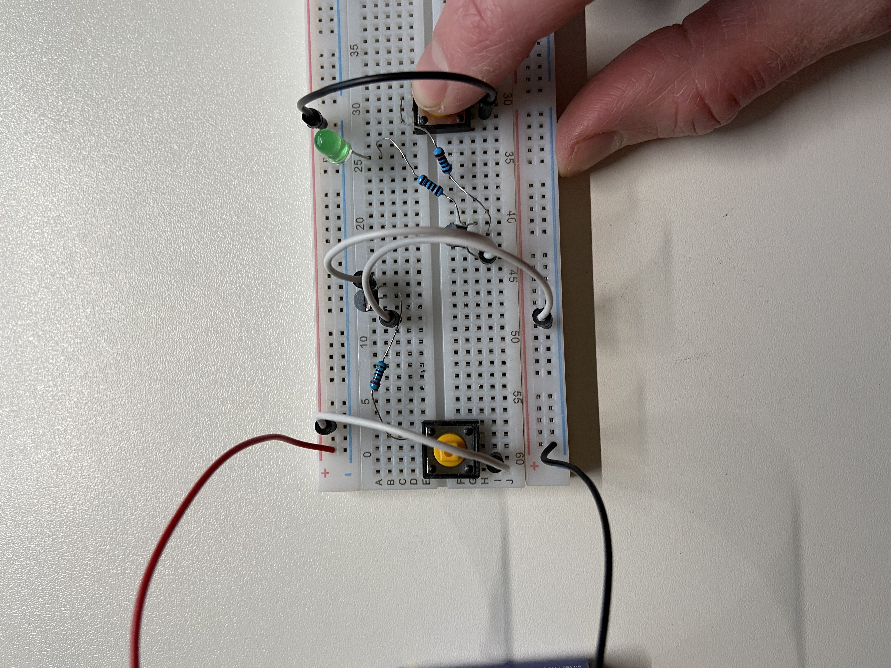
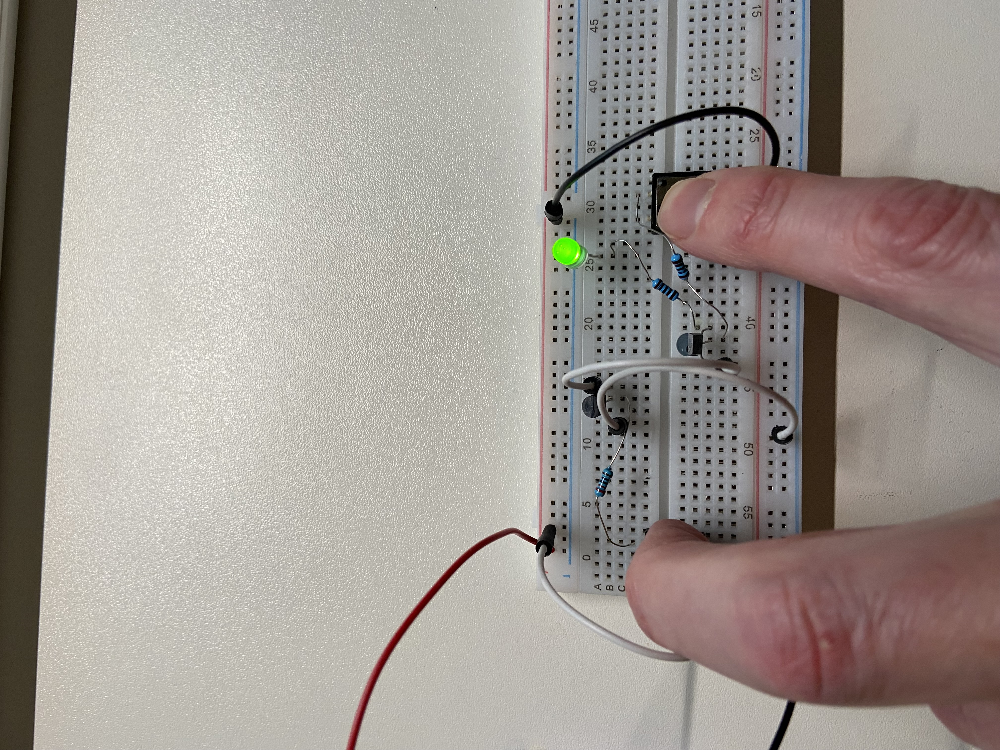

## Embedded Rust notes


### Microcontroller Unit (MCU)
Is a very small computer system self contained on an integrated circuit (IC).
They normally don't have any external data storage available so everything has
to be able to be stored in memory (or perhaps sent off somewhere to be stored
elsewhere).

Is what actually runs our code. It looks like a small black box and has a
number of small metal pins around it. The pins are connected to tracers that
are like wires connecting components on the board.

### Analog-to-digital conversion (ADC)
Microcontrollers convert analog values (continuous) that arrive on inputs (pins)
into to digital values (descrete) to be processed.


### ARM (Advanced RISC Machines/Acorn RISC Machines)
ARM holding is the company behind Arm based chips do not manufacture chips
but instread they design parts of the chip and they license these designs to
hardware manufactures that use them in their products (sometimes enhancing
them). In contrast Intel both design chips and manufacture them.

Arm has a number of families of chip designs. For example there is the Cortex-M
family which are mostly used in microcontrollers.

Cortex-M0 is designed for low cost/power usage.
Cortex-M4 is a middle ground more features/performance than M0 but less
expensive then M7.

Cortex-M7 is higher cost but has more features and better performance.
Some additional information about Arm version can be found
[here](https://github.com/danbev/learning-assembly/tree/master/arm#arm-versions).


### Universal Synchronous and Asynchronous Receiver-Transmitter (USART)
Is a serial communication protocol which as the name suggests can be used
sync (using clocks) or async(using start/stop bits).
```
     Device 1               Device 2
    +----------+           +----------+
    |        TX|-----------|RX        |
    |        RX|-----------|TX        |
    |       GND|-----+-----|GND       |
    +----------+     |     +----------+
                     |
                   -----
                    ---
                     -
```
The sender and reicever must agree on a data transfer rate, which is called the
baud rate which is number of bits transferred per second.
Simplex mode is when data is transferred in one direction only.
Half-duplex is when data is transferred in both directions but not at the same
time.
Full-duplex is when data can be transferred simultainously in both directions at
the same time.

The wire protocol:
```
  +-----------+-------------+---------------+-------------+
  |1 start bit|5-9 data bits|0-1 parity bits|1-2 stop bits|
  +-----------+-------------+---------------+-------------+
```

### Controller Area Network (CAN)
TODO:


### Real Time Operating Systems (RTOS)
TODO:

### Serial communication
Is the process of transmitting one bit of data at a time. Thing of this as being
one wire and the bits flow through it.
Only requires one wire which is one reason at it is used often in
microcontroller system design.

Would require only two wires:
```
  +---------+ b0 b1 b2 b3 b4 b5 b6 b7     +---------+
  |      OUT|-----------------------------|IN       |
  |         | p1 p2 p3 p4 p5 p6 p7 p8     |         |
  |      CLK|-----------------------------|CLK      |
  +---------+                             +---------+

p = puls of the clock
```
So this would send one bit per plus of the clock.

### Parallel communication
Is the process of transmitting multiple bits of data at one time. Think of this
as muliple wires connected to the other side and multiple bits can be set and
transmitted at once.
Since it requires more wires it can be more expensive to implement.
Crosstalk is an issue and it is susceptible to clock skew.
```
  +---------+                             +---------+
  |     OUT0|-------------b0--------------|IN0      |
  |     OUT1|-------------b1--------------|IN1      |
  |     OUT2|-------------b2--------------|IN2      |
  |     OUT3|-------------b3--------------|IN3      |
  |     OUT4|-------------b4--------------|IN4      |
  |     OUT5|-------------b5--------------|IN5      |
  |     OUT6|-------------b6--------------|IN6      |
  |     OUT7|-------------b7--------------|IN7      |
            |             p1              |
  |      CLK|-----------------------------|CLK      |
  +---------+                             +---------+

p = puls of the clock
```
So this would send 8 bit per plus of the clock.

### Synchronous transmission
It's called synchronous because the sender and reciever are synchronized. They
both have a clock which use the same rate.

A clock in this case is something that changes between two values, like high/low
or something like that. The sender might send only when the clock is high for
example. This is not much of a problem if both sender and reciever share the
same clock, if they are part of the same circuit for example, but if they are
not it might be difficult as they need someway of sharing the clock.

Fast transmission (when is has been sent).
May have to wait until data can be sent.

Examples are SPI, and I²C.

### Asynchronous transmission
This type of communication is not synced, but instead it uses a start bit and
and stop bit
```
           start bit    stop bit
               ↓ [ data ]       ↓
    +--------+ 0 11101001 1       +--------+
    | Sender | -----------------> |Reciever|
    +--------+                    +--------+
```
The extra processing of the start/stop bit can affect performance making
asynchronous slower. 
Is cheap and easy to implement (no clock sharing).
Can transmit whenever it is ready (does not have to wait for the clock).


### Clock
Is a signal that repeats/oscillates between high and low states:
```      ____   ____  ____
high 1   |   |  |  |  |  |
         |   |  |  |  |  |    
low  0----   ----  ----  ----  ...
```
So it starts out at zero, changes to 1 for the same amount of time and then
repeats like this. The clock tell us when the receiver should read from the
data line. We might say that it should receive when the clock is high but notice
that the line can be hight for a certain period of time. Instead we say that it
should read when transitioning from low to high, and this point is called an 
edge:
```      ____   ____  ____
high 1   |   |  |  |  |  |
         |   |  |  |  |  |    
low  0----   ----  ----  ----  ...
         ^   ^
raising edge +-- fallin edge
     (from low   (from high
      to high)    to low)
```
This is a single point instead of a region.

So lets say we want to send 5 (101). First we have to let the receiver know that
we are going to send by setting a wire to high which is sometimes called slave
select (SS_bar). After this is done we can send bits to the receiver:
```
    Sender                   Receiver
             -
             |
             |
    CLK    --*             > CLK

101 SOUT   --1-------------> RIN  1
```
So above when the first raising edge is encountered, remember that the sender
and receiver share the same clock line so the receiver also knows when this
happens. When this happens SOUT will become high for the binary digit 1 to be
sent. This can then be read by the reciever from RIN above and placed into
a buffer. The next time there is a raising edge encountered (clock tick) another
bit will be placed in SOUT:
```
    Sender                   Receiver
             ----  -
             |  |  |
             |  |  |
    CLK   ----  ---*       > CLK

10  SOUT   --------0-------> RIN  10
```
And so on:
```
    Sender                   Receiver
             ----  ----
             |  |  |  |
             |  |  |  |
    CLK   ----  ----  ---* > CLK

10  SOUT   --------------1-> RIN  101
```
I'm not 100% sure about the above but that is my understanding so far. I'm
still waiting for a real device to try this out and verify.

### Serial Peripheral Interface (SPI) 
Is a synchronous serial communication spec developed by Motorola (1980s) and
used for communicating between microcontrollers and small peripheral devices.
Note that this is a defacto standard but there is no official standard for this
protocol.

```
   +-----------------+           +-----------------+
   | SPI         SCLK|-------+-->|SCLK   SPI       |
   | Controller  COPI|------+--->|COPI   Peripheral|
   |             CIPO|<----+-----|CIPO             |
   |           SS_bar|---------->|SS_bar           |
   +-----------------+     |||   +-----------------+
                 ^         |||
                 |         |||   +-----------------+
                 |         ||+-->|SCLK   SPI       |
                 |         |+--->|COPI   Peripheral|
                 |         +-----|CIPO             |
                 +-------------->|SS_bar           |
                                 +-----------------+

SCLK = SPI Clock
CIPO = Controller Input Peripheral Output
COPI = Controller Output Peripheral Input
SS   = Slave Select (to select among mulitiple connected slaves like above) 
```
* Full Duplex
* Synchronous (it uses the clock to sync)
* 4+ wires (with multiple slaves there will be more than 4 wires)
* 25 Mbps
* No ack
* Low power consumption
* 20 cm distances

### Universal Asynchonous Receiver/Transmitter (UART)
UART is not a communications protocol like SPI and I2C but instead a physical
component/circuit in a microcontroller or a standalone integrated circuit.
It is main purpose is to send and receive serial data.

An UART can look something like the following:
```
  Data bus	 +------------+           +------------+      Data bus      
	    ---->|D0  P|S     |           |    P|S   D0|---->
            ---->|D1  A|E     |           |    A|E   D1|---->
            ---->|D2  R|R     |           |    R|R   D2|---->
            ---->|D3  A|I   RX|<----------|TX  A|A   D3|---->
            ---->|D4  L|A   TX|---------->|RX  L|L   D4|---->
            ---->|D5  L|L     |           |    L|    D5|---->
            ---->|D6  E|      |           |    E|    D6|---->
            ---->|D7  L|      |           |    L|    D7|---->
		 |     |      |           |     |      |
		-|R/W  |      |           |     |   R/W|
		-|CLK  |      |           |     |   CLK|
		-|INT  |      |           |     |   INT|
		 +------------+           +------------+
```

An packet on the serial wire (TX->RX) will looks something like this:
```
   +-+ +-+-+-+-+-+ +--+  +--+
   |S| | | | | | | |P |  |ST|
   +-+ +-+-+-+-+-+ +--+  +--+
  Start    Data   Parity Stop
```
The transimission line (TX) is usually held at a high voltage when not
trasmitting. To start sending the trasmitting UART will pull the TX line from
high to low for one clock cycle. When the receiving (RX) UART see this it will
begin reading the bits in the dataframe at the frequency of the baud rate.
Notice that the sender will get the data to be sent from the data bus, and
likewise the reciever will place the received data on the data bus.

So there are only two wires which is a nice property. And there is not clock
signal required between two UARTs. There is also parity checking which is
good for reliable communication.
One thing to note is that the data being sent can be a maxium of 9 bits. 
The is not way to support multiple peripherals.


### Inter Integrated Circuit (I²C)
Only requires two pins.
```
   +------------------+           +-----------------+
   | Controller    SCL|-----------|SCL  Peripheral  |
   |               SDA|-----------|SDA              |
   +------------------+           +-----------------+
 
SCL = Serial Clock Line for the clock signal
SDA = Serial Data line for sending and recieving data
```
So we have the usage of a clock so this is a synchronous protocol like SPI.

Data is transported in messages which have a specific format and an address
is used to identify the destination peripheral:
```
   +-+-+-+-+-+-+-+ +---+ +---+  +-+-+-+-+-+-+-+-+
   | | | | | | | | |R/W| |ACK|  | | | | | | | | |
   +-+-+-+-+-+-+-+ +---+ +---+  +-+-+-+-+-+-+-+-+
    Address Frame                      Data Frame
    (7 or 10 bits)                     (8 bits)
```
Communication starts by the SDA (the data line) switches form high voltage
to low. This is done before the SCL also switches from high to low.

At the end the sending the SDA will switch from low voltage level to high
`after` the SCL line switches from low to high.

In SPI we had a peripheral select wire (SS) which selected the peripheral we
want to talk to. Instread in I2C each peripheral has an address. This is
contained in the address frame which is always first frame after the start bit
has been set. The controller send this message frame onto the SDA which all
peripherals connected will see. Each peripheral will compare this to their
address and do nothing if the address does not match. If the addresses match
that peripheral sends a low voltage ACK bit back to the controller.

The READ/WRITE bit indicates if the controller wants to send or recieve data
from the peripheral. If it wants to send then this bit is low (0) and if it
wants to read it will be a high voltage.

### Current
Is the flow of free electrons

### Concuctors
Take a conductor like a coppar wire which is good at allowing a current to flow
through it. Now, coppar is made up on coppar atoms which like all atoms contain
protons, neutrons, and electrons:
```
Cu
Protons: 29
Neutrons: 35
Electrons: 29
           Shell 1: 2 electrons
           Shell 2: 8 electrons
           Shell 3: 18 electrons
           Shell 4: 1 electrons (free electron)
```
A coppar wire without any current flowing will have electrons randomly moving
from atom to atom but this is not in any perticular direction. If an electron
moves away from its atom that would leave the atom slightly positively charged
and that would attract an electron. How does the electron leave the atom, this
is a little unclear to me. One thing I've read is that it is actually the atom
that overlap the volume of other atoms and exchange the free atom. So there
does not need to be any energy to cause the electron to move. But I've also read
that this could be influence of room-temprature heat energy.

So we have the sea of electrons that are
moving around randomly. Now, if we connect a cell that contains one end with
negative electrons and the otherside with atoms what are positivly charged (
would attract electrons) the electrons will move towards the positiv end.

The conduction band is the band above the valence band. 
```
----------------------- 
                        Conduction band
-----------------------
                        Band gap
-----------------------
                        Valance band 
-----------------------
        ...
----------------------- Electron shell n-1
```
For electrons to be able to move to an outer shell energy needs to be applied.
For conductors the conduction band and the valance band/band gap/conduction band
overlap allowing the free electrons to move in this space. But for insulators
there is a clear band gap and energy is required for this to happen (that is
if there are free electrons in the valance shell), if we are thinking of atoms
where no energy is applied to it.

Bond:
When an atom bonds with another they can share electrons in their valence shell,
this type of bond is called covalent bond.

Take two silicon atoms for example, they would share a pair of electrons:
```
   *     *                * = electron in valance shell
                         ** = paired electrons
*  Si ** Si *

   *      *
```
Many silicon atoms that are bonded like this will allow for each Si atom to be
connected though sharing four electrons:

This is something that can be seen in silicon where each silicon atom is
connected to four other silicon atoms. 

If a conductor (metal) is heated it becomes less conductive. So metals conduct
electricity better at colder temperatures.

### Band theory
```
Energy
 ^
 |                                           +--------------+
 |                                           | Conduction   |
 |                       +--------------+    |              |
 |                       | Conduction   |    +--------------+
 |   +--------------+    |              |
     | Conduction   |    +--------------+
     |--------------|
     |--------------|    +--------------+    +--------------+
     | Valancy      |    | Valancy      |    | Valancy      |
     +--------------+    +--------------+    +--------------+
     Conductors          Semiconductors      Insulators
```
Notice that for conductors the conduction band and the valancy band overlap
which is why the conduct so well. 
For semiconductors there is a gap between these two bands so energy is needed
for electrons to move into the conduction band. This is possible with heat.


### Insulators
High reisistance to the flow of electricity, which means that their valance
shell is full and 


### Semi-conductors
These have properties that are in between conductors and insulators, hence the
name semi-conductors. If a semi-conductor is exposed to head this can improve it
conductivity. But there is another way to improve the conducitivty of a semi-
conductor which is to add impurities to it (called doping).

If we take a look at a silicon cristal:
```
                                          [* *] = covalent bond
 Si  [* *]  Si  [* *]  Si  [* *]

 ⌈*⌉       ⌈*⌉         ⌈*⌉
 ⌊*⌋       ⌊*⌋         ⌊*⌋
       
 Si  [* *]  Si  [* *]  Si  [* *]

 ⌈*⌉       ⌈*⌉         ⌈*⌉
 ⌊*⌋       ⌊*⌋         ⌊*⌋

 Si  [* *]  Si  [* *]  Si  [* *]
```
So we can see that we have these covelent bounds between the atoms and all of
the free electrons in the valance shell are bound. There are not free electrons
of "holes".

If we replace on of these atoms will an atom with only 5 electrons (like fosfor)
in its valance shell what would happen:
```
                                          [* *] = covalent bond
 Si  [* *]  Si  [* *]  Si  [* *]

 ⌈*⌉       ⌈*⌉         ⌈*⌉
 ⌊*⌋       ⌊*⌋         ⌊*⌋
                 *<-------------------- free electron
 Si  [* *]  P  [* *]  Si  [* *]

 ⌈*⌉       ⌈*⌉         ⌈*⌉
 ⌊*⌋       ⌊*⌋         ⌊*⌋

 Si  [* *]  Si  [* *]  Si  [* *]
```
It can still bound with the other 3 atoms around it but also has an additional
electron left over. This free electron can now move in the conduction band. This
makes this silicon cristal more conductive then before. Because we have a free
electron by this process and electrons are negatively charged this is called
an n-type conductor now.
So that is one way we can increase the connectivity of silicon. But how about
replacing an atom with something that only has 3 electrons in its valance shell:

So if we hook up a battery to this the free electron will be attracted to the
positive terminal and the electrons from the negative terminal will be able
to move in their place through the material (in/through the conduction band):
```
                                          
     Si  [* *]  Si  [* *]  Si  [* *]

     ⌈*⌉       ⌈*⌉         ⌈*⌉
     ⌊*⌋       ⌊*⌋         ⌊*⌋
                 *
+--- Si  [* *]  P  [* *]  Si  [* *] <-----------+
|                                               |
|    ⌈*⌉       ⌈*⌉         ⌈*⌉                  |
|    ⌊*⌋       ⌊*⌋         ⌊*⌋                  |
|                                               |
|    Si  [* *]  Si  [* *]  Si  [* *]            |
|                                               |
|                 |                             |
|                 ||                            |
+-------------> + || - -------------------------+
                  |
```
It can still bound with the other 3 atoms around it but also has an additional

So lets try with alunminum (Ai):
```
                                          [* *] = covalent bond
 Si  [* *]  Si  [* *]  Si  [* *]

 ⌈*⌉       ⌈*⌉         ⌈*⌉
 ⌊*⌋       ⌊*⌋         ⌊*⌋
                 
 Si  [* *]  Ai  x  *  Si  [* *]

 ⌈*⌉       ⌈*⌉         ⌈*⌉
 ⌊*⌋       ⌊*⌋         ⌊*⌋

 Si  [* *]  Si  [* *]  Si  [* *]
```
Notice that we have a missing electron so thre is no covalent bond between the
Ai atom the Ai atom to the right. This is called a p-type semi-conductor. This
also conducts electricity better than pure silicon so the conductivity goes up.

In the case of N-type we know that the electrons are free to flow in the
conduction band. This is not what happens for P-type, instead the electrons flow
in the valance band, so if we apply a current electrons will be attracted to
the positive terminal, hence they will move to holes:
```
     Si  [* *]  Si  [* *]  Si  [* *]

     ⌈*⌉       ⌈*⌉         ⌈*⌉
     ⌊*⌋       ⌊*⌋         ⌊*⌋
                 *
+--- Ai  x *   Si  [* *]   Si  [* *] <-----------+
|                                                |
|    ⌈*⌉       ⌈*⌉         ⌈*⌉                   |
|    ⌊*⌋       ⌊*⌋         ⌊*⌋                   |
|                                                |
|    Si  [* *]  Si  [* *]  Si  [* *]             |
|                                                |
|                 |                              |
|                 ||                             |
+-------------- + || - <-------------------------+
                  |
```
The holes are what allow electrons to flow and this happens in the valance band
as opposed to n-type doping where the flow happens in the conduction band.
With a batteri cell attached the electrons will be attracted to the positive
terminal. There for electrons will fill the holes:
```
 x  o  x  x  x
     <-
 x  x  o  x  x
        <-
 x  x  x  o  x
           <-
 x  x  x  x  o
```
Now, what I think will  happen is that one electron will "leave" and and one
will enter:
```
x <- o  x  x  x  o <-x
     o  x  x  x  x 
```
And once again the process of the electrons filling the holes will continue and
a electrons will be transferred/conducted accross the valance band.

Now, lets see what happens if we combine a p-type and an n-type:
```
                                          [* *] = covalent bond
                                              x = hole
                                              * = free electron
         P-type                          N-type

 Si  [* *]  Si  [* *]  Si    |  |  Si  [* *]  Si  [* *]  Si  [* *]
                             |  |
 ⌈*⌉       ⌈*⌉         ⌈*⌉   |  |  ⌈*⌉       ⌈*⌉         ⌈*⌉
 ⌊*⌋       ⌊*⌋         ⌊*⌋   |  |  ⌊*⌋       ⌊*⌋         ⌊*⌋
                             |  |                *
                             |  |                 
 Si  [* *]  Ai  x  *  Si     |  |  Si  [* *]  P  [* *]   Si  [* *]
                             |  |
 ⌈*⌉       ⌈*⌉         ⌈*⌉   |  |  ⌈*⌉       ⌈*⌉         ⌈*⌉
 ⌊*⌋       ⌊*⌋         ⌊*⌋   |  |  ⌊*⌋       ⌊*⌋         ⌊*⌋
                             |  |
 Si  [* *]  Si  [* *]  Si    |  |   Si  [* *]  Si  [* *]  Si  [* *]
```
The free electron would be attracted to fill the hole 
```
 Si  [* *]  Si  [* *]  Si    |  |  Si  [* *]  Si  [* *]  Si  [* *]
                             |  |
 ⌈*⌉       ⌈*⌉         ⌈*⌉   |  |  ⌈*⌉       ⌈*⌉         ⌈*⌉
 ⌊*⌋       ⌊*⌋         ⌊*⌋   |  |  ⌊*⌋       ⌊*⌋         ⌊*⌋
                +-------------------------------- * 
                ↓            |  |
 Si  [* *]  Ai  x  *  Si     |  |  Si  [* *]  P  [* *]   Si  [* *]
                             |  |
 ⌈*⌉       ⌈*⌉         ⌈*⌉   |  |  ⌈*⌉       ⌈*⌉         ⌈*⌉
 ⌊*⌋       ⌊*⌋         ⌊*⌋   |  |  ⌊*⌋       ⌊*⌋         ⌊*⌋
                             |  |
 Si  [* *]  Si  [* *]  Si    |  |   Si  [* *]  Si  [* *]  Si  [* *]
```
One thing that I was missing is that even though there is an extra electron,
the Ai has an additional proton (remember that atoms have the same number of
proton and electrons) so that side is neutral, both sides are to begin with.

And a hole can also move to the n-type side. This will create an area between
these two where there are now extra electrons, or any extra holes, so there
are now charge carriers in this region. This region is called the depletion
region and it like an insulator.
```
                Depletion Region
            N          ↓       P
      +----------------+---------------+
      | * * ** *** * * |  o o oo ooo   |
      | ** * **  * * * | o o o o o  oo |
      | * * ** *** *   |o o o o        |
      | * * ** *** *   |  o   o  o  o o|
      +----------------+---------------+
               Depletion Region
            N          ↓       P
      +--------------+----+-------------+
      | * * ** *** * | Si |o o oo ooo   |
      | ** * **  * * | Si | o o o o  oo |
      | * * ** *** * | Si |o o o        |
      | * * ** *** * | Si |o   o  o  o o|
      +--------------+----+-------------+
```

Now if we hook up a power source we will not get a current flowing initially as
the depletion region prevents the flow. But if the batteri has enough voltage,
like > 0.7v this will overcome the.
```
               Depletion Region
            N          ↓        P
      +--------------+----+-------------+
      | * * ** *** * | Si |o o oo ooo   |
 +--> | ** * **  * * | Si | o o o o  oo |---------+
 |    | * * ** *** * | Si |o o o        |         |
 |    | * * ** *** * | Si |o   o  o  o o|         |
 |    +--------------+----+-------------+         |
 |                                                |
 |                   |                            |
 |              -  | | +                          |
 +-----------------| |<---------------------------+
                   | | 
                     |
```
Electrons will enter the n-region and there will be more electrons in that
region. There will also be electrons (remember there are holes but there are
also electrons in this region. Those electrons will be attracted to the positive
terminal and will exit leaving more holes behind. If the batteri has a voltage
> 0.7 the depletion region will collapse and current can flow.

Now lets hook this up the other way, where the negative terminal is connected
to the p-type region, and the positive terminal to the n-type region:
```
               Depletion Region
            N          ↓        P
      +--------------+----+-------------+
      | * * ** *** * | Si |o o oo ooo   |
 +----| ** * **  * * | Si | o o o o  oo |<--------+
 |    | * * ** *** * | Si |o o o        |         |
 |    | * * ** *** * | Si |o   o  o  o o|         |
 |    +--------------+----+-------------+         |
 |                                                |
 |                 |                              |
 |              +  | | -                          |
 +---------------->| |----------------------------+
                   | | 
                   | 
```
In this case the electrons will fill the holes in the p-region, and electrons
will leave the n-region, causing the depletion region to become larger:
```
               Depletion Region
            N         ↓           P
      +---------------------------------+
      | * * ** **|    Si    |o oo ooo   |
 +----| ** * **  |    Si    | o o o  oo |<--------+
 |    | * * ** * |    Si    |o o        |         |
 |    | * * ** * |    Si    |  o  o  o o|         |
 |    +--------------+----+-------------+         |
 |                                                |
 |                 |                              |
 |              +  | | -                          |
 +---------------->| |----------------------------+
                   | | 
                   | 
```
As the depletion region becomes larger meaning that there are no charge carriers
in this region this component will act like an insulator. So no current will
flow.

If we stick an n-type region next to a p-type and then another n-type we get
the following:
```
                    Depletion Regions
                     |          |
            N        ↓    P     ↓     N
      +-------------+-+--------+-+----------+
      | * * ** *** *| |o o oo o| |* * * * * |
      | ** * **  *  | | o o o o| |  * *  ** |
      | * * ** ***  | |o o o   | | *   * *  |
      | * * ** *** *| |o   o  o| |  * * * * |
      +-------------+-+--------+-+----------+
```
And say we want a current to flow through this thing:
```
                    Depletion Regions
                     |          |
            N        ↓    P     ↓     N
      +-------------+-+--------+-+----------+
      | * * ** *** *| |o o oo o| |* * * * * |
 +--->| ** * **  *  | | o o o o| |  * *  ** |-----+
 |    | * * ** **   | |o o o   | | *   * *  |     |
 |    | * * ** ** * | |o   o  o| |  * * * * |     |
 |    +-------------+-+--------+-+----------+     |
 |                                                |
 |                                                |
 |                                                |
 |                                                |
 |                   |                            |
 |              -  | | +                          |
 +-----------------| |<---------------------------+
                   | | 
                     |
```
Well this will increase number of electrons in the left-most n-type region,
and some electrons will leave the right-most n-type region but there will not
be a current flowing. 

Lets try looking up a second power source like this:
```
                    Depletion Regions
                     |          |
            N        ↓    P     ↓     N
      +-------------+-+--------+-+----------+
      | * * ** *** *| |o o oo -| |+ * * * * |
 +--->| ** * **  *  | | o o o -| |+ * *  ** |-----+
 |    | * * ** **   | |o o o  -| |+*   * *  |     |
 | +--| * * ** **  *| |o   o  -| |+ * * * * |     |
 | |  +-------------+-+--------+-+----------+     |
 | |                 |     |                      |
 | |             - | | +   |                      |
 | +---------------| |-----+                      |
 |                 | | >0.7v                      |
 |                   |                            |
 |                                                |
 |                   |                            |
 |              -  | | +                          |
 +-----------------| |<---------------------------+
                   | | 
                     |
```
Notice that this extra connection between the left-most n-type and the p-type
is the same as we hade above where we saw that current would flow through that
connetion.
Now, we have electrons entering from both battries. When they make these types
of components the first n-type region is very heavyly doped. So once this
second current starts flowing, those extra electrons can now also move through
into the p-type region. Some of these electrons are going to fill in holes in
the p-type region, and some are also going to be attracted to the outgoing plus
terminal of the p-type region. The base is very thin (how they are manufactured)
and these holes are physically close to the left-most n-type's electrons. That
depletion region was created when electrons left the n-type into the depletion
region which caused the n-type region to become positivley charged (remember
that the number of electrons and protons match up when neutral and removing a
electron will make the atom postitive). And those electrions that move into
depletion region cause the p-type region to become negatively charged.
The electrons that have now started flowing through the p-type region will be
attracted to the positive right-most n-type region and therefor be able to
flow through it towards the positive terminal output.

This component is called an NPN bipolar junction transistor:
```
        Emitter(N)      Base(P)  Collector(N)
      +-------------+-+--------+-+----------+
      | * * ** *** *| |o o oo -| |+ * * * * |
 +--->| ** * **  *  | | o o o -| |+ * *  ** |-----+
 |    | * * ** **   | |o o o  -| |+*   * *  |     |
 | +--| * * ** **  *| |o   o  -| |+ * * * * |     |
 | |  +-------------+-+--------+-+----------+     |
 | |                 |     |                      |
 | |             - | | +   |                      |
 | +---------------| |-----+                      |
 |                 | | >0.7v                      |
 |                   |                            |
 |                                                |
 |                   |                            |
 |              -  | | +                          |
 +-----------------| |<---------------------------+
                   | | 
                     |
```
Alright, so that was the theory now lets see how we can create a circuit
with such an NPN transistor:

For this example I used as button switch which is connected to the base of the
transistor:



So with out a current flowing through the base and the emitter there is no
current flowing though the transistor. Pressing the button will cause a current
to flow:




So that is how a NPN Bipolar Junction transistor works and how we can hook it
up physically. We can use two such transistors:



Now, pressing just the left button no current will flow:


And, pressing just the right button no current will flow:


But pressing both and current will flow:


Notice that what we have created here is a AND gate:
```
Left button | Right button   LED
          0 | 0              0 (Off)
          1 | 0              0 (Off)
          0 | 1              0 (Off)
          1 | 1              1 (On)
```


Before any movement has occured we have the following Formal Charge for P
```
     ⌈*⌉
     ⌊*⌋ *
[* *] P [* *]
     ⌈*⌉
     ⌊*⌋

Bounds: 4
FC = valance electrons - (Bonds + dots)
   =                 5 - (4+1) 
   = 0               
```
And for Ai:
```

     ⌈*⌉
     ⌊*⌋ 
[* *]Ai  x *
     ⌈*⌉
     ⌊*⌋
FC = 3 - (3 + O)
FC = 0
```
Now, after the move of the free electron to the hole we have the following
formal charge for P:
```
FC = 5 - (4 + 0)
   = 1
```
This means that it has a positive formal charge.
And for Ai:
```
     ⌈*⌉
     ⌊*⌋ 
[* *]Ai  [* *]
     ⌈*⌉
     ⌊*⌋

FC = 3 - (4 + O)
FC = 3 - 4
FC = -1
```

```
       P                            N
+--------------------+-------------------------+
| o       o     o    | *    *       *        * |
|     o    o    o    |    *     *     *        |
|  o     o         o |            *       *    |
| o    o   o         | *   *  *     *    *     |
+--------------------+-------------------------+
```

The free electrons will drift to fill in the holes:
```
       P                            N
+--------------------+-------------------------+
| o       o     o   <--*    *       *        * |
|     o    o    o   <--   *     *     *        |
|  o     o         o<--           *       *    |
| o    o   o        <--*   *  *     *    *     |
+--------------------+-------------------------+
```

```
       P                            N
+--------------------+-------------------------+
| o       o     o   -|+*    *       *        * |
|     o    o    o   -|+   *     *     *        |
|  o     o         o-|+           *       *    |
| o    o   o        -|+*   *  *     *    *     |
+--------------------+-------------------------+
```
```
       P                            N
+--------------------+-------------------------+
| o       o     o   | |*    *       *        * |
|     o    o    o   | |   *     *     *        |
|  o     o         o| |           *       *    |
| o    o   o        | |*   *  *     *    *     |
+--------------------+-------------------------+
                     ^
                  Electric field accross the PN junction
```
The electric field makes it difficult for new electrons on the N side to cross
the PN junktion now. The free electrons still have a force acting upon them that
wants to move them to the other side, but there is also a force acting in the
opposite direction. When these forces are equal then no electrons will move over
from the right side to the left side.

So applying a current to the N side that overcomes the force of the PN junction
would allow electrons to move through to the P side and beyond if the P-side
is connected to something. Reversing this process, that is connecting a voltage
to the anode (P-side) will not cause any (or vary little current to flow). I'm
taking about electron current here and not convertional current.
So the flow of electrons can only happen in one direction.

```
       P                            N
+--------------------+-------------------------+
| o       o     o   | |*    *       *        * |
|     o    o    o   | |   *     *     *        |
|  o     o         o| |           *       *    |
| o    o   o        | |*   *  *     *    *     |
+--------------------+-------------------------+
   Anode                   Cathode

----->|---
 <-- e⁻
            +----+----+  
  anode-----| P  | N  |-----cathode
            +----+----+
```

### Light Emitting Diod
Notice that this is basically a Diode that can emit light. 
```
    +--+
    |  |
    +--+
    |  |
    |  |
    |  |
    |  
Anode  Cathode
```
When we connect these the electron current must flow through the cathode so it
should be connected to the negative output of the batteri.


### Bipolar Junction Transistors.
There are two (bi) junctions (think of the PN junctions in a diode as explained
above):
```
  +-----+-----+-----+
  |  N  |  P  |  N  |
  +-----+-----+------
        ^     ^  
   junction  junction
       1        2
```
The N is for N-Type, and P for P-Type which are the same as in the diode example
above.
```
      +-----+-----+-----+
E-----|  N  |  P  |  N  |-----C
      +-----+-----+------
               |
               |
               B
E = emitter
C = collector
B = base
```
So we would have free electrons in the left and right boxes, and holes in the
middle box. And notice if we removed the first box we would be left with a
normal diode:
```
            +-----+-----+
            |  P  |  N  |-----C (cathode)
            +-----+------
               |
               |
               B (anode)
```
And the addition of the first N box is basically the reversal of a diode

### Metal Oxide Semiconductor Field Effect Transistor (MOSFET)

```
   +----------------------+
   |                      |
   |   P-Type Substrate   |
   |                      |
   |                      |
   |                      |
   +----------------------+

   +----------------------+
   |+---+          +---+  |
   || N |          | N |  |
   ||   |          |   |  |     S = Source
   || S |          | D |  |     D = Drain
   ||   |          |   |  |
   |+---+          +---+  |
   +----------------------+
```
So at this stage we have a PN junction between the substrate and the two N-type
regions.
Next an oxide insulator is added between the two N-types. 
And on top of that a metal later is added.
And this is the origin of the first part of the name, Metal for the metal plate,
oxide for the insulator, and semiconductor for the PN.

```        
  ----+              |           +----
      |              |           |
      |       ----------------   |
      |       ----------------   |
   +----------------------------------+
   || N        |            |    N   ||
   |+----------+            +--------+|
   |    ^                        ^    |
   |    +----  pn junction  -----+    |
   |                                  |
   +----------------------------------+

```

### Formal Charge
```
FC = Valance electrons - (Bonds + dots)
```

### ARM Vector table
Contains functions pointers to handlers of exceptions (and perhaps the
ResetHandler in entry 0 but that is not clear to me yet).

### ARM Exceptions
This is a condition that changes the normal flow of control in a program.

Exceptions have a number associated with them and this is used as an index into
the Vector Table which contains function pointer to Exception Handlers or
Interrupt Service Routine (IRS). The ARM hardware will look up and call the
function when an exception is triggered.
```
1  Reset
2  NMI
3  HardFault
4  MemoryManagement
5  BusFault
6  UsageFault
7  Reserved
8  Reserved
9  Reserved
10 Reserved
11 SVCall
12 DebugMonitor
13 Reserved
14 PendSV
15 SysTick
16 External interrupt 0
...
```

Each Exception also has a priority number.

All Cortex-M variants support 6 exceptions:
1. Reset
This is the function called when the chip comes out of reset, like power on, or
the reset button is pressed (can this be called programatically also?).

2. Non Maskable Interrupt (NMI)
If an error happens in another exception handler this function will be called
to handle it. It cannot be masked to be be ignore.

3. HardFault
This is used for various system failures. There are also more fine grained
exceptions handlers for MemoryManagement, BusFault, UsageFault.

4. SVCall
This is the exception handler that will take care of supervisor call (svc)
instruction is called.

5. PendSV/SysTick
System level interrupts triggered by software and seem to be used mostly for
RTOS.

If we take a look at the symbols we should be able to see the above handlers:
```console
$ cargo objdump --release -- -t
    Finished release [optimized] target(s) in 0.05s

app:	file format elf32-littlearm

SYMBOL TABLE:
...
0000055a g     F .text	00000000 DefaultHandler
00000040 g     O .vector_table	000003c0 __INTERRUPTS
0000055a g     F .text	00000000 BusFault
0000055a g     F .text	00000000 DebugMonitor
0000055a g     F .text	00000002 DefaultHandler_
0000055c g     F .text	00000002 DefaultPreInit
0000068e g     F .text	00000002 HardFault_
0000055a g     F .text	00000000 MemoryManagement
0000055a g     F .text	00000000 NonMaskableInt
0000055a g     F .text	00000000 PendSV
00000400 g     F .text	0000007c Reset
0000055a g     F .text	00000000 SVCall
0000055a g     F .text	00000000 SysTick
0000055a g     F .text	00000000 UsageFault
0000047c g     F .text	0000000a main
0000068e g     F .text	00000000 HardFault
```

### LoRaWAN 
Is a Low Power Wide Area Network (LPWAN)


### Drogue Device

The following example code is from device/examples/std/hello:
```rust
pub struct MyDevice {
    counter: AtomicU32,
    a: ActorContext<'static, MyActor>,
    b: ActorContext<'static, MyActor>,
    p: MyPack,
}

static DEVICE: DeviceContext<MyDevice> = DeviceContext::new();
```
So in this case we are creating a new instance of DeviceContext with a specific
type of MyDevice.

```rust
pub struct DeviceContext<D: 'static> {
    device: Forever<D>,
    state: AtomicU8,
```
Forever is struct from Embassy and has a static lifetime and can only be
written to once so it is good for initialization of things.
```rust
pub struct Forever<T> {
    used: AtomicBool,
    t: UnsafeCell<MaybeUninit<T>>,
}
```
We can configure, mount, and drop a DeviceContext. When we configure we
are giving the Forever a value:
```rust
    DEVICE.configure(MyDevice {
        counter: AtomicU32::new(0),
        a: ActorContext::new(MyActor::new("a")),
        b: ActorContext::new(MyActor::new("b")),
        p: MyPack::new(),
    });
```
This is done by calling `put` which gives the Forever a value:
```rust
    pub fn configure(&'static self, device: D) {
        match self.state.fetch_add(1, Ordering::Relaxed) {
            NEW => {
                self.device.put(device);
            }
            _ => {
                panic!("Context already configured");
            }
        }
    }
```
Note that `self` is an instance of `DeviceContext<hello::MyDevice`:
```console
(lldb) expr self
(drogue_device::kernel::device::DeviceContext<hello::MyDevice> *) $5 = 0x00005555558a90c0
```
And we can see that `state` is of type AtomicU8 which means that it can be
safely shared between threads. We can see that we have multiple threads:
```console
(lldb) thread list
Process 775026 stopped
* thread #1: tid = 775026, 0x00005555555b0308 hello`hello::mypack::MyPack::new::h37a13cbcb2b29e39 at mypack.rs:14:9, name = 'hello', stop reason = breakpoint 1.1
  thread #2: tid = 775029, 0x00007ffff7c8ca8a libpthread.so.0`__futex_abstimed_wait_common64 + 202, name = 'hello'
```

`fetch_add` adds to the current value of this atomic integer and returns the
previous state.
This is in match so if the previous/current state state is NEW, we will call
`put` on the Forever giving it a value. And remember that it will also increment
the value so it will now be 1 which is `CONFIGURED`.

Next we have:
```rust
let (a_addr, b_addr, c_addr) = DEVICE                                          
        .mount(|device| async move {                                               
            let a_addr = device.a.mount(&device.counter, spawner);              
            let b_addr = device.b.mount(&device.counter, spawner);              
            let c_addr = device.p.mount((), spawner);                              
            (a_addr, b_addr, c_addr)                                               
        })                                                                         
        .await;         
```
Notice that we are calling `mount` on our DeviceContext instance which is
typed over MyDevice.

```rust
pub async fn mount<FUT: Future<Output = R>, F: FnOnce(&'static D) -> FUT, R>(  
        &'static self,                                                             
        f: F,                                                                   
    ) -> R {                                                                    
        match self.state.fetch_add(1, Ordering::Relaxed) {                         
            CONFIGURED => {                                                        
                let device = unsafe { self.device.steal() };                       
                let r = f(device).await;                                           
                                                                                   
                r                                                                  
            }                                                                      
            NEW => {                                                               
                panic!("Context must be configured before mounted");               
            }                                                                   
            MOUNTED => {                                                        
                panic!("Context already mounted");                              
            }                                                                   
            val => {                                                            
                panic!("Unexpected state: {}", val);                            
            }                                                                   
        }                                                                       
    }                         
```
Notice that this method takes a closure. Remember that we incremented the state
previously so it is currently CONFIGURED, and we now increment it again using
`fetch_add` which as before will return the current value so we will enter
the CONFIGURED branch of the match statement: 
```console
(lldb) expr self->state.v.value
(unsigned char) $11 = '\x01'
```
We then get the value of the device and pass that to the closer (so we will
be back in main.rs in the closure:
```console
  38  	    let (a_addr, b_addr, c_addr) = DEVICE
   39  	        .mount(|device| async move {
-> 40  	            let a_addr = device.a.mount(&device.counter, spawner);
   41  	            let b_addr = device.b.mount(&device.counter, spawner);
   42  	            let c_addr = device.p.mount((), spawner);
   43  	            (a_addr, b_addr, c_addr)
   44  	        })
   45  	        .await;
```
Next we will call each of the MyDevice struct members `mount` methods.


### drogue-tls logging
Logging can be enabled using
```console
$ RUST_LOG=info cargo test --verbose --  --nocapture
```

### Critical sections
It is possible to disable interrupts temporarily and then enable them again
using `cortex_m::interrupt::free`. This will disable interrupts, then run the
code in the code in the passed in closure, and then enable interrupts again.


### Pin::block 
I was a little confused about what this function did and about its name. It is
defined like this:
```rust
    pub trait Pin {
        fn pin_port(&self) -> u8;

        #[inline]
        fn _pin(&self) -> u8 {
            self.pin_port() % 16
        }
        #[inline]
        fn _port(&self) -> u8 {
            self.pin_port() / 16
        }

        #[inline]
        fn block(&self) -> gpio::Gpio {                                         
            pac::GPIO(self._port() as _)                                        
        }                             
```
What I think this refers to is the block of GPIO register that this Pin belongs
to. In `embassy/stm32-data/data/registers/gpio_v2.yaml we have the following:
```rust
block/GPIO:                                                                        
  description: General-purpose I/Os                                                
  items:                                                                        
    - name: MODER                                                               
      description: GPIO port mode register                                      
      byte_offset: 0                                                            
      fieldset: MODER                                                           
    - name: OTYPER                                                              
      description: GPIO port output type register                               
      byte_offset: 4                                                            
      fieldset: OTYPER                                                          
    - name: OSPEEDR                                                             
      description: GPIO port output speed register                              
      byte_offset: 8                                                            
      fieldset: OSPEEDR                                                         
    - name: PUPDR                                                               
      description: GPIO port pull-up/pull-down register                         
      byte_offset: 12                                                           
      fieldset: PUPDR                                                           
    - name: IDR                                                                 
      description: GPIO port input data register                                
      byte_offset: 16                                                           
      access: Read                                                              
      fieldset: IDR                                                             
    - name: ODR                                                                 
      description: GPIO port output data register                               
      byte_offset: 20                                                           
      fieldset: ODR                                                             
    - name: BSRR                                                                
      description: GPIO port bit set/reset register                             
      byte_offset: 24                                                           
      access: Write                                                             
      fieldset: BSRR                                                            
    - name: LCKR                                                                
      description: GPIO port configuration lock register                        
      byte_offset: 28                                                           
      fieldset: LCKR                                                            
    - name: AFR                                                                 
      description: "GPIO alternate function register (low, high)"               
      array:                                                                    
        len: 2                                                                  
        stride: 4                                                               
      byte_offset: 32                                                           
      fieldset: AFR
```
The above source for Pin::block is generated and something that I'd like to take
a closer look at later. TODO: describe the generation process.
